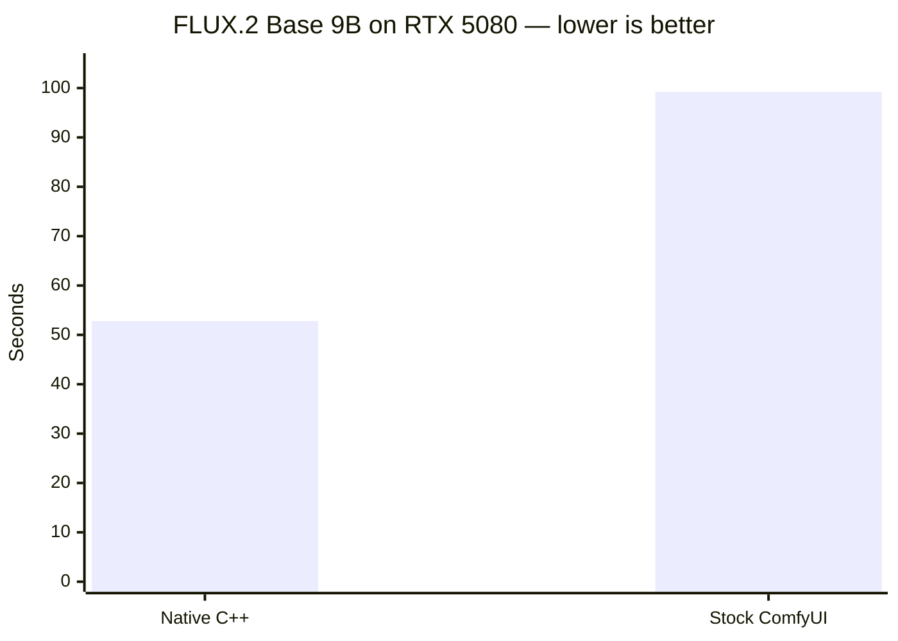
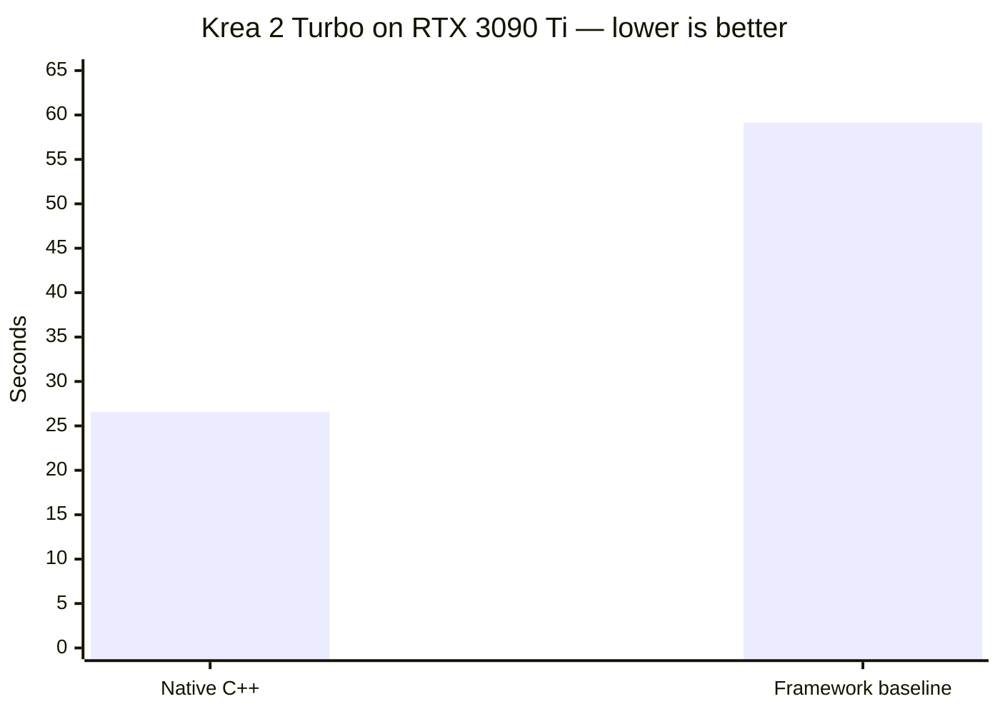
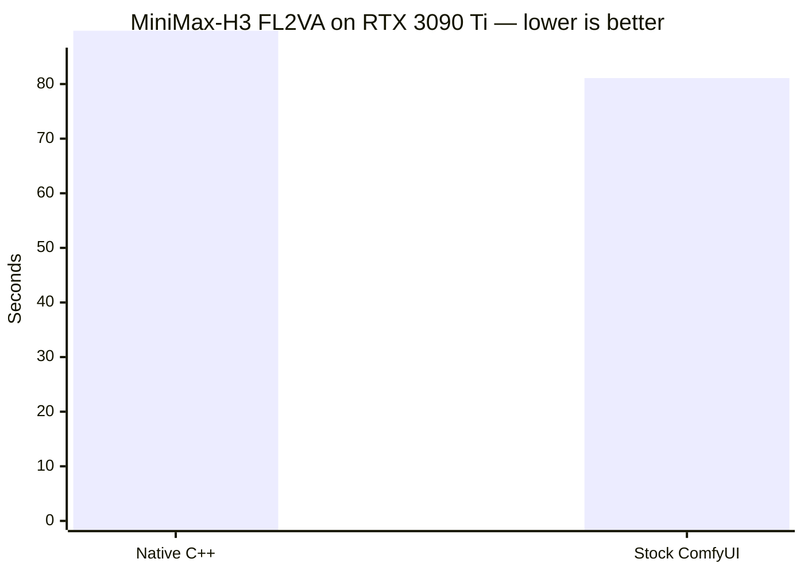

# Diffusion Compiler performance

This file owns the measured speed results that used to make the main README
hard to scan. Times are complete product walls unless a row explicitly says it
is denoiser-only. Lower is better. Ratios compare the native compiler with the
matched framework baseline on the same GPU and workload.

## Speed gains at a glance

| Model and product boundary | GPU | Native C++ | Matched baseline | Native result |
|---|---|---:|---:|---:|
| FLUX.2 [klein] Base 9B, prompt to PNG | RTX 5080 | **52.809 s** | 99.242 s | **1.879x faster** |
| Krea 2 Turbo, prompt to PNG | RTX 3090 Ti | **26.58 s** | 59.14 s | **2.225x faster** |
| MiniMax-H3 FL2VA, prompt to MP4 | RTX 3090 Ti | **89.77 s** | 81.095 s | **1.107x slower** |

The model rows are different workloads and hardware targets. Compare native
with baseline within a row; do not compare raw seconds across rows.

### FLUX.2 prompt-to-PNG wall

### Krea 2 prompt-to-PNG wall

### H3 prompt-to-MP4 wall

## FLUX.2 [klein] Base 9B — RTX 5080

The frozen workload uses the official undistilled Base 9B transformer, creator
generalized-time Euler schedule, creator F32 VAE, 1024x1024 output, 50 steps,
guidance 4, seed `20260901`, and the literal prompt
`A cat holding a sign that says hello world`.

| Measurement | Native admitted plan | Stock ComfyUI |
|---|---:|---:|
| Prompt to PNG, three-run range | **52.793–52.842 s** | 99.242 s |
| Prompt to PNG, median | **52.809 s** | 99.242 s |
| Denoise wall, measured range | 47.767–47.930 s | included in product wall |
| Streamed transformer weights per step | **0 B** | framework-managed |
| Resident transformer weights | 9,107,591,168 B | framework-managed |
| Peak prepared native bytes | 11,349,488,128 B | 15,641 MiB peak NVML |

Native saves **46.433 seconds**, or **46.788%** of baseline latency. That meets
the approved near-55-second target but is not labeled a 2x result.

The admitted denoiser plan applies generic H4096 F32 signed ConvRot W8A8 to 112
linears, uses group-64 INT8 weight-only storage for the nine remaining
linears, and uses group 32 for `final_layer.linear.weight`. Only the packed
single-stream input projections use activation clip ratio `0.999`; every other
activation ratio remains `1.0`. Exact attention uses cuDNN SDPA heuristic A.
The 14,800 MiB first-consumer residency plan keeps every transformer weight
resident during denoising.

The unchanged final-token gate passes against the frozen native creator oracle:

| Gate | Result |
|---|---:|
| Cosine | 0.9988074500 |
| Relative L2 | 0.0488599297 |
| Maximum absolute error | 1.73046875 |
| Norm ratio | 1.0007087464 |
| Nonfinite values | 0 |

The decoded PNG passed full-resolution visual inspection for anatomy, fur,
exposure, color, and legible `hello world` text. Its SHA-256 is
`600a201c6a76dc4d23ea19c9603f79ec765f344400460c6e441e161d07f5cde1`.

The practical ComfyUI comparator matches transformer, prompt, seed, geometry,
steps, guidance, schedule class, and F32 VAE. Its packaged Qwen conditioner is
FP8-mixed while native conditioning is BF16; that physical precision difference
is disclosed. The native executable links no libtorch or libpython and invokes
no Python worker.

## Krea 2 Turbo — RTX 3090 Ti

The complete warm-page-cache workload is 1024x1024, 4096 image tokens, 512 text
tokens, 28 MMDiT blocks, BF16 production math, eight Euler steps, CFG disabled,
and `mu=1.15`. Prompt, seed, initial latent, schedule, checkpoint, and
conditioning boundary are fixed.

| External stage | Native C++ | Creator / ComfyUI / PyTorch BF16 |
|---|---:|---:|
| Tokenizer + Qwen3-VL | 2.28 s | 9.05 s |
| TextFusion | 1.29 s | 7.52 s |
| Prepared 8-step denoise | 19.54 s | 34.26 s |
| Qwen-Image VAE + PNG | 3.43 s | 8.31 s |
| **Prompt to PNG** | **26.58 s** | **59.14 s** |

That is a measured **2.225x complete-chain speedup**. The native run recorded
zero filesystem input, so this is a warm-page-cache result. A separate
cold-filesystem native diagnostic took 55.58 seconds, dominated by 27.42
seconds of Qwen weight page-in.

All eight denoiser states and the final latent are bit-identical to the frozen
creator trajectory. The VAE gate passes at cosine `0.99999339` and relative L2
`0.00363512` after clamping. The inspected PNG SHA-256 is
`eea79ee7d84a703235481b0e1859ca087fa20d40304aa0243d9929da8333fbfd`.

The framework comparator is ordinary eager ComfyUI/PyTorch without
`torch.compile` or Inductor fusion. The strict comparator uses the creator
padding mask and matching post-TextFusion boundary. Stock ComfyUI's Krea
frontend omitted that mask at main blocks in the checked revision, so its
product timing is retained but is not a numerical-parity arm.

## MiniMax-H3 FL2VA — RTX 3090 Ti

The matched contract is two keyframes, 832x480, 124 delivered frames at 24 fps,
207 audio latents, 1,256 conditioner tokens, sequence length 16,880, and seven
`res_multistep`/`simple` evaluations. Both measurements cover a literal prompt
through the saved H.264/AAC MP4.

| Complete-wall measurement | Time |
|---|---:|
| Native Compiler ConvRot INT8, exact attention on evaluations 1-3, INT8 attention on 4-7 | **89.77 s** (runs 89.77, 102.44, 88.54; median) |
| Native Compiler ConvRot INT8 + INT8 attention on every evaluation (2026-09-01, retired for quality) | 78.88 s |
| Matched stock ComfyUI ConvRot INT8, INT8 attention on every evaluation | 81.095 s |
| Strict 2x ceiling | <40.548 s |

Native is **1.107x slower** than the comparator, 8.675 seconds or 10.7%, and
49.2 seconds above the strict 2x ceiling; no H3 speed result is claimed. The
comparator has not been measured at matched exactness.

Why the recipe changed (2026-09-03): the seven-evaluation latents were
decoded with the INT8 attention route on every evaluation, with exact cuDNN
attention on every evaluation, and with exact attention on the first two,
three, and four evaluations, all from identical inputs, and gated with
`difquality` against the exact decode (bars PSNR 30 dB, SSIM 0.90, audio SNR
20 dB, eight sampled frames):

| attention route | worst frame PSNR | worst SSIM | audio SNR | denoise cost |
|---|---:|---:|---:|---:|
| INT8 on all 7 (former recipe; also the comparator's route) | 24.5 dB | 0.850 | 1.7 dB | 0 |
| exact on 1-2 | 27.1 dB | 0.908 | 3.1 dB | +7 s |
| exact on 1-3 (recipe) | 32.3 dB | 0.958 | 12.9 dB | +10.5 s |
| exact on 1-4 | 37.5 dB | 0.978 | 14.7 dB | +14 s |
| exact on all 7 | reference | | | +24.4 s |

The INT8 route's per-evaluation error is amplified along the sampler
trajectory; the comparator produces the same off-reference output because it
dispatches the same INT8 kernel. The video bars pass from three exact
evaluations; the audio stays under the 20 dB bar and was accepted on a
listening review, which the recorded `difquality` verdict does not replace
(it stays FAIL on the audio bar). Each exact evaluation costs about 3.5 s
(10.6-10.8 s versus 7.2-7.6 s).

The native chain includes presentation, Qwen3-VL vision/text conditioning,
both keyframe encodes, seven denoiser evaluations, video/audio decode, and mux.
The saved 832x480 MP4 contains 124 H.264 frames at 24 fps plus 32 kHz stereo AAC
and passed visual inspection. Its SHA-256 is
`cfb0c6b8110ff2dda9a0a240e57b5a16476cff0b3c5c41872f131e2ebc21e64f`.
The saved MP4 from the current recipe (run 2 of the protocol) has SHA-256
`63c2551ef666c130df09341f599c94fa9974afd295683d9cc336654d1d2dccea`. Decoded
parity with exact attention is as tabulated above; parity with the stock
competitor is not the bar any more, since the competitor's output is the
INT8-only one.

An exact-output QKV/RMSNorm/RoPE fusion improved isolated hot denoiser timing
but regressed complete wall to 84.49 seconds warm and 92.05 seconds cold. It was
removed; local kernel wins do not override the complete-wall result.

### Exact stream attention (Implementation 5) — RTX 5080

`dif_exact_stream_attention` is a project-owned exact dense non-causal
attention backend for `Opcode::Attention` (noncausal BF16 `[S,H,128]` /
`[B,S,H,128]`, full heads, no bias): flash-style FP32 online softmax, K/V
tiles streamed through 48 KiB of shared memory with cp.async double
buffering, Q fragments and the FP32 output accumulator register resident,
zero global workspace. Both Q·Kt and P·V use BF16 operands with FP32
accumulation. This preserves V's BF16 exponent range and prevents the FP16
tile-sum overflow found with Q=K=0, S=32, V=4096 (the previous kernel
returned infinity instead of 4096).

The measurements below are historical results from the earlier FP16 P·V
kernel. They do not establish performance or end-to-end parity for the
corrected BF16/FP32 kernel; those full-model gates must be remeasured.

Isolated H3 DiT geometry `[16880,56,128]` BF16, warm, 20 iterations, three
interleaved sessions, real-data inputs (constant-fill inputs understate time
by ~13% through power draw): exact-stream 67.50–67.77 ms vs cuDNN SDPA
69.97–70.10 ms (1.035x) vs native FlashAttention-2 74.87 ms.  Numerics vs
cuDNN: cosine 0.9999967, rel L2 2.55e-3, max abs 4.88e-4, 0 nonfinite —
tighter than the cuDNN-vs-FlashAttention exact noise floor (3.10e-3).
Against an f64 oracle at the full geometry: cosine 0.9999986, rel L2
1.69e-3.

Whole-system A/B on the RTX 5080 T2VA chain (832x480x124, S=15,283, 20
schedule points, 19 evaluations, ConvRot INT8 resident 28): denoiser wall
105.56/105.86 s (cuDNN) vs 103.43/103.52 s (exact-stream), attention GPU
time 54.55/54.83 s vs 52.35/52.41 s — a reproducible 2.2-second (2.1%)
complete-denoise saving with byte-identical planned VRAM
(13,878,443,008 bytes) and bit-identical repeat runs per backend.
End-to-end latent divergence from cuDNN (cosine 0.913 after 19 evaluations)
is smaller than exchanging cuDNN for FlashAttention-2 (0.907); decoded MP4s
from both backends passed visual inspection.  The frozen RTX 3090 Ti FL2VA
row above is unchanged; its fixtures and GPU gate cannot run on this
machine.

## Reporting rules

- Freeze checkpoint, prompt, seed, resolution, steps, guidance, scheduler, and
  output gate before comparing plans.
- Call a timing end-to-end only when it spans literal input to saved output.
- Keep cold, warm, preparation, and hot-step measurements separate.
- Admit speed only after numerical, visual-quality, memory, and replay gates.
- Never manufacture a gain with fewer steps, lower resolution, changed
  conditioning, or relaxed quality thresholds.
